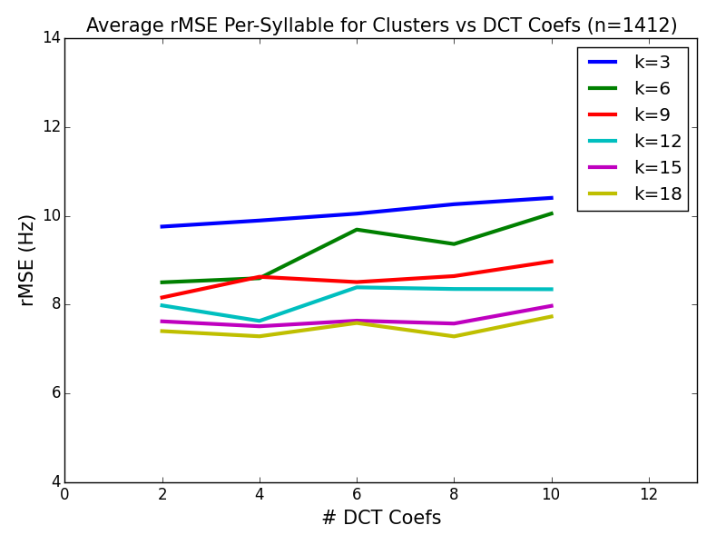
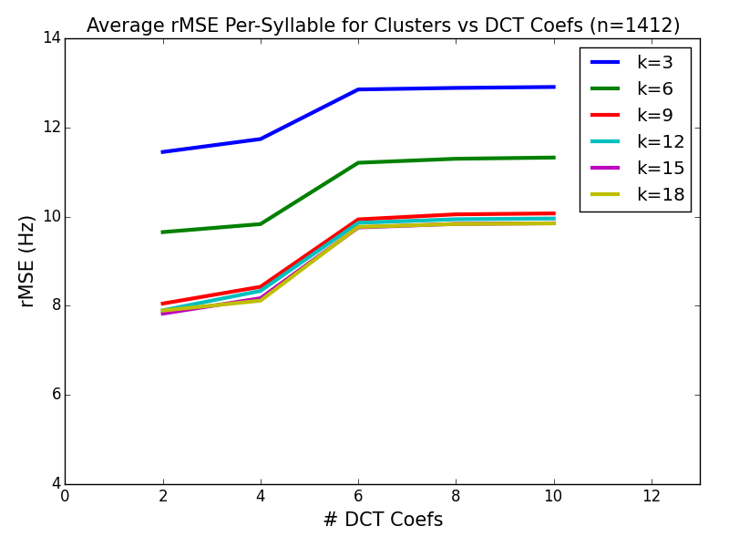
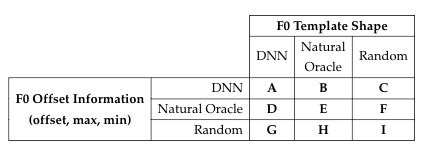

## Audio Samples 

This page provides audio samples from Jennifer Williams's MScR thesis titled: 
"Syllable-Based Prosody Modeling in DNN Text-to-Speech"

### F0 Reconstruction From Templates (Chapter 3)

#### Method 1

##### k=3, dct=4
<audio src="Method1/3_4.mp3" controls preload></audio>

##### k=6, dct=4
<audio src="Method1/6_4.mp3" controls preload></audio>

#### Method 2

##### k=3, dct=4
<audio src="Method2/3_4.mp3" controls preload></audio>

##### k=6, dct=4
<audio src="Method2/6_4.mp3" controls preload></audio>

### Listening Test Experiments (Chapter 5)

#### Overview of Variable Conditions

#### Condition A
<audio src="exp_cond/A/1.wav" controls preload></audio>
<audio src="exp_cond/A/2.wav" controls preload></audio>

#### Condition B
<audio src="exp_cond/B/1.wav" controls preload></audio>
<audio src="exp_cond/B/2.wav" controls preload></audio>

#### Condition C
<audio src="exp_cond/C/1.wav" controls preload></audio>
<audio src="exp_cond/C/2.wav" controls preload></audio>

#### Condition D
<audio src="exp_cond/D/1.wav" controls preload></audio>
<audio src="exp_cond/D/2.wav" controls preload></audio>

#### Condition E
<audio src="exp_cond/E/1.wav" controls preload></audio>
<audio src="exp_cond/E/2.wav" controls preload></audio>

#### Condition F
<audio src="exp_cond/F/1.wav" controls preload></audio>
<audio src="exp_cond/F/2.wav" controls preload></audio>

#### Condition G
<audio src="exp_cond/G/1.wav" controls preload></audio>
<audio src="exp_cond/G/2.wav" controls preload></audio>

#### Condition H
<audio src="exp_cond/H/1.wav" controls preload></audio>
<audio src="exp_cond/H/2.wav" controls preload></audio>

#### Condition I
<audio src="exp_cond/I/1.wav" controls preload></audio>
<audio src="exp_cond/I/2.wav" controls preload></audio>

